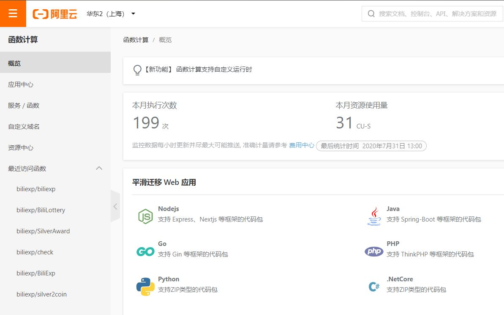
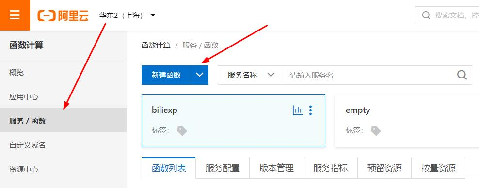
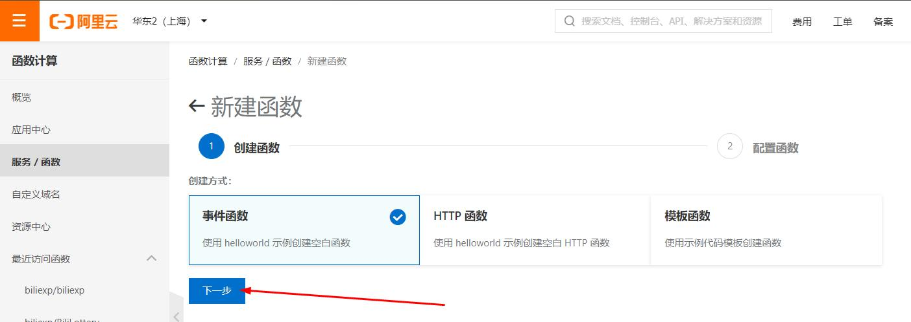
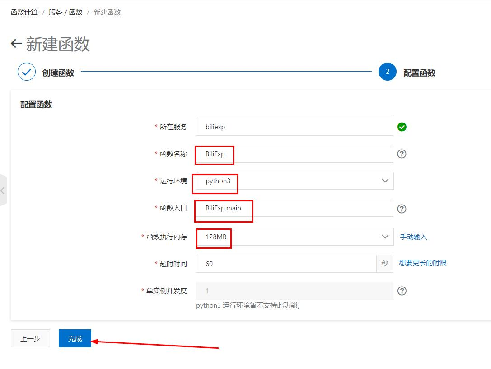
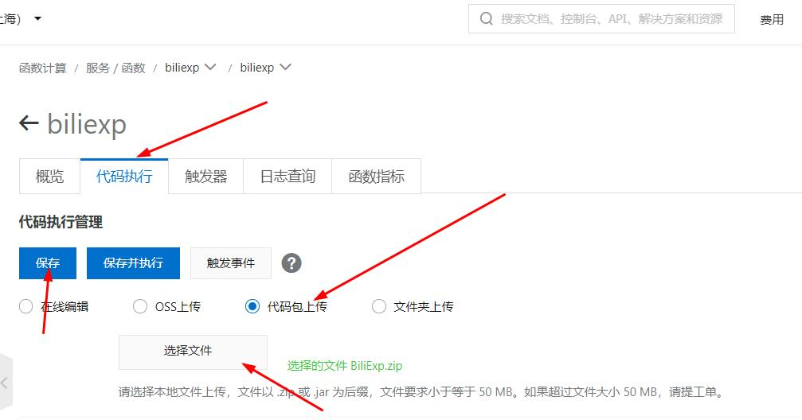
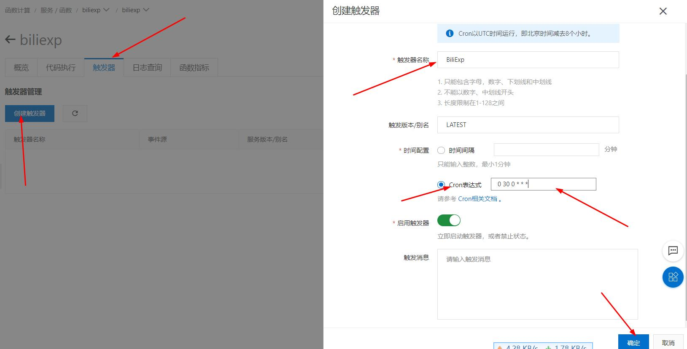

# BiliExp
B站自动操作脚本(投币、点赞、分享视频，直播签到，自动转发抽奖，漫画APP签到) 
脚本up主系列(python实现B站专栏的编写，排版和发表)

## 2020/08/06更新

* 1.发现B站app的access_key与漫画app通用，调整了app相关api的结构
* 2.新增加Article类实现专栏的自动发表,Article.Content类实现B站专栏内容的排版(支持插入B站所有标签)
* 3.增加两个自动发表B站专栏的例子(1.收集自己动态里的抽奖内容并发表到专栏；2.自动收集P站图片并转载到专栏(此脚本发表的图片通不过B站审核))
* 4.利用B站专栏的图片上传接口可能能实现把B站当做免费图床？(大雾)？

## BiliExp主要文件及功能？

* BiliExp.py：B站直播签到，投币点赞分享，模拟观看视频，一键获取经验
    *  需要将用户SESSDATA，bili_jct，DedeUserID三个cookie填入userData.py脚本内
    *  支持多账户
    *  支持云函数每日执行
    *  支持微信消息推送脚本运行结果,需要将SCKEY填入userData.py脚本内(感谢server酱提供的推送微信消息服务，详情见http://sc.ftqq.com/)

* BiliLottery.py：B站动态一键抽奖
    *  需要将用户SESSDATA，bili_jct，DedeUserID三个cookie填入userData.py脚本内
    *  支持云函数每日执行
    *  建议每隔10分钟运行一次

* silver2coin.py：一键将银瓜子兑换成硬币
    *  需要将用户SESSDATA，bili_jct，DedeUserID三个cookie填入userData.py脚本内
    *  支持多账户
    *  支持云函数每日执行
    *  每天只能执行不超过一次

* SilverAward.py：B站直播领取时间宝箱获取银瓜子
    *  需要将B站app登录后获得的access_key填入userData.py脚本内
    *  支持多账户
    *  支持云函数执行
          *  普通用户每天可领取三轮，建议云函数触发器cron表达式为0 0,3,9,18,21,27,36,39,45,54 2 \* \* \*
          *  大老爷用户每天可领取五轮，建议在普通用户的基础上增加一个云函数触发器cron表达式为0 0,6,15,18,24,33 3 \* \* \*

* mangaClockIn.py：一键签到B站漫画客户端，获得积分和漫读劵(连续一周)
    *  需要将B站漫画app登录后获得的access_key填入userData.py脚本内
    *  支持多账户
    *  支持云函数每日执行

* userData/check.py：检查userData.py内账户的有效性
    *  支持云函数每日执行
    *  支持微信消息推送脚本运行结果,需要将SCKEY填入userData.py脚本内(SCKEY的获取见http://sc.ftqq.com/)
    
* userData/userData.py：账户文件，存放cookie和access_key保持账户登录状态
    

B站操作需要的cookie数据可以按照以下方式获取
浏览器打开B站主页--》按F12打开开发者工具--》application--》cookies

## 使用方法(以阿里云函数为例)
##### 1.准备工作

 * 1.1 在https://github.com/happy888888/BiliExp/releases/ 下载zip包并解压，在userData/userData.py文件中填写账户cookie，B站app的access_key（仅领取时间宝箱获取银瓜子的功能需要），B站漫画app的access_key（仅漫画app签到需要），server酱的SCKEY（仅微信推送需要，详情见sc.ftqq.com）。
 * 1.2 返回上级目录，将所有.py文件和文件夹全选中右键压缩为.zip文件(并非把所有文件放在一个文件夹下压缩)。

##### 2.部署投币、点赞、分享视频，直播签到脚本

 * 2.1 进入阿里云函数https://fc.console.aliyun.com/fc/overview/cn-shanghai  

 * 2.2 点击"服务/函数"--》"新建函数" 

 * 2.3 点击"下一步" 

 * 2.4 函数名称随意填写，运行环境选择"python3"，函数入口填写"BiliExp.main"，点击"完成" 

 * 2.5 在"代码执行"页面中选择"代码包上传"，点击"选择文件"，上传1.1中的压缩包，点击"保存" 

 * 2.6 点击"触发器"--》"创建触发器"，服务类型选择"定时触发器"，触发器名称随意填写，时间配置选择"Cron表达式",内容填写"0 30 0 \* \* \*"(不要引号，意思是每天凌晨0:30执行一次)，点击"确定" 

##### 3.部署自动抽奖脚本

 * 3.1 重复步骤2.1 - 2.6，仅把步骤2.4中函数入口填写改为"BiliLottery.main"，把步骤2.6中"cron表达式"改为"0 \*/10 0 \* \* \*"(意思是每10分钟执行一次)

##### 4.部署直播领取时间宝箱获取银瓜子脚本

 * 4.1 重复步骤2.1 - 2.6，仅把步骤2.4中函数入口填写改为"SilverAward.main"，把步骤2.6中"cron表达式"改为"0 \*/10 1,2 \* \* \*"(意思是在每天1点和2点，每10分钟执行一次)

##### 5.部署银瓜子兑换硬币脚本

 * 5.1 重复步骤2.1 - 2.6，仅把步骤2.4中函数入口填写改为"silver2coin.main"，把步骤2.6中"cron表达式"改为"0 0 4 \* \* \*"(意思是在每天4点执行一次)

##### 6.部署漫画签到脚本

 * 6.1 重复步骤2.1 - 2.6，仅把步骤2.4中函数入口填写改为"mangaClockIn.main"，把步骤2.6中"cron表达式"改为"0 0 1 \* \* \*"(意思是在每天1点执行一次)

##### 7.部署账户登录状态检测脚本(账户失效后会微信推送)

 * 7.1 重复步骤2.1 - 2.6，仅把步骤2.4中函数入口填写改为"userData/check.main"，把步骤2.6中"cron表达式"改为"0 0 0 \* \* \*"(意思是在每天0点执行一次)

 关于自动抽奖脚本带来的动态臃肿问题，建议定期删除已经过期的抽奖动态。删除过期抽奖动态的方法参见本项目下的browser_assist文件夹

