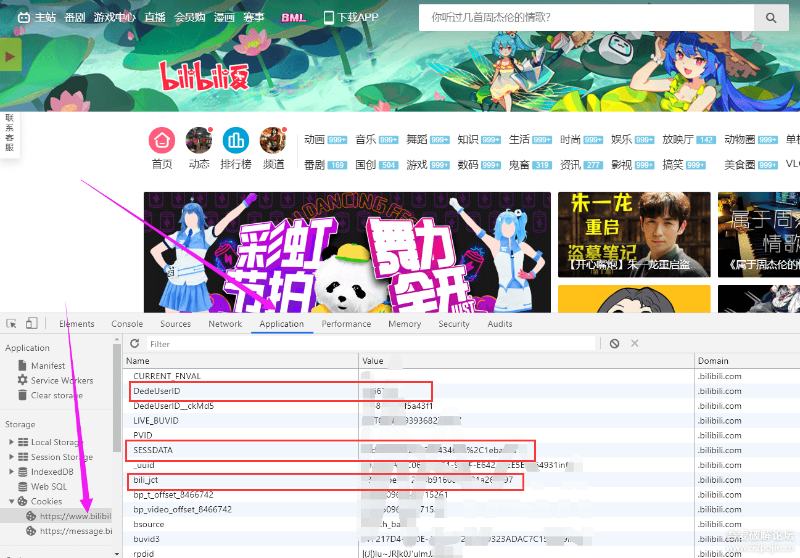

# BiliExp
B站自动操作脚本(投币、点赞、分享视频，直播签到，直播挂机，自动送出快过期礼物，自动转发互动抽奖，漫画APP签到，参与官方抽奖活动，定时清理无效动态，~~直播开启宝箱领取银瓜子(本活动已结束，不知道B站以后会不会再启动)~~)  
脚本up主系列(python实现B站专栏的编写，排版和发表，视频稿件的上传和发布)
  

# 使用方式
* 1.准备
    *  1.1开通云函数计算的阿里云账号，以及账号的ACCOUNT_ID，ACCESS_KEY_ID，ACCESS_KEY_SECRET
    *  1.2一个或多个B站账号，以及登录后获取的SESSDATA，bili_jct，DedeUserID (获取方式见最下方示意图)
    *  1.3SCKEY (可选，用于账号失效时用微信提醒,不用请留空，详情见http://sc.ftqq.com/)
    *  1.4fork本项目
* 2.部署
    *  2.1在fork后的github仓库的 “Settings” --》“Secrets” 中添加"Secrets"，name和value分别为：
        *  2.1.1 name为"ACCOUNT_ID"           value为阿里云用户的账号ID
        *  2.1.2 name为"ACCESS_KEY_ID"        value为阿里云账户AccessKeyID(需要主账户，子账户可能没权限)
        *  2.1.3 name为"ACCESS_KEY_SECRET"    value为阿里云账户accessKeySecret
        *  2.1.4 name为"biliconfig"           value为B站账号登录信息，格式参照config/config.json文件
    *  2.2添加完上面4个"Secrets"后，进入"Actions" --》"deploy for aliyun"，点击右边的"Run workflow"即可部署至阿里云函数
        *  2.2.1 首次fork可能要去actions里面同意使用actions条款，如果"Actions"里面没有"deploy for aliyun"，则需要提交一次，在/.github/workflows/deploy_for_aliyun.yml里加个回车，提交后就能在"Actions"里找到"deploy for aliyun"了

注:账号cookie检查每天0:10执行1次(填写SCKEY后账号登录状态失效会微信通知)；投币、点赞、分享视频，直播签到，送出直播即将过期礼物 每天0:20执行1次；参与B站官方抽奖活动每天0:30执行1次；漫画app签到每天0:40执行1次；直播开启宝箱领取银瓜子1:00-2:00之间每隔10分钟运行1次(非大老爷用户每天最多领取9轮)；将银瓜子兑换为硬币每天3:00执行1次；B站转发互动抽奖和发送直播在线心跳维持在线状态每隔10分钟运行1次(之所以转发抽奖10分钟执行1次而不是每天执行1次是为了及时转发，如果同时转发太多抽奖可能被B站列为异常转发)；清理B站无效动态半个月1次。最后注意不要在github上直接在config/config.json中填写账号信息，而是在Secrets中填写，避免账号信息泄露。
  

## 2020/08/28更新

* 1.截至今天，B站直播开时间宝箱领取银瓜子的活动已经结束
* 2.B站官方活动里面的 "夏日不宅宣言" 活动和 "新星计划-暑假赛" 活动已经结束，新增加"最强安利王"活动

  
## 2020/08/25更新

* 1.增加送出即将过期的直播礼物的功能
* 2.增加直播心跳维持在线状态的功能(非大老爷用户在线时长并不能加经验)

  
## 2020/08/22更新

* 1.使用Actions实现脚本自动部署到阿里云，代替本文最下方的手动部署方式(已删除)

  
## 2020/08/21更新

* 1.增加doActivity.py用于参加B站官方活动(抽奖类) 活动列表 https://www.bilibili.com/blackboard/x/act_list/
    *  活动列表(抽奖类)存放在config/activity.json中
        *  每个活动都有过期时间(目前的大部分活动都将在8.30日前过期)，活动中抽奖也有参与次数限制
        *  有的活动每天固定赠送抽奖次数，有的活动需要转发，还有的活动需要关注投币点赞甚至投稿才能获得抽奖次数，本脚本只能做每天固定赠送抽奖次数，和转发获得抽奖次数的活动
        *  活动过期或添加新活动均需手动更新activity.json，有新活动或者活动是否过期都可以在上面活动列表网址查看
    * 本人首次在"舞见大合集"活动中抽中一个"小电视抱枕"，第一次在B站中抽中实物，记录一下☺️
* 2.增加cleanDynamic.py用于清理转发的动态
    *  清理的转发动态包括:①互动抽奖过期的动态；②两个月前带#互动抽奖#标签的动态；③被原up主删除的动态
* 3.用户配置文件仅需要cookies，不需要再获取客户端的access_key，access_key从用户配置文件移除，用户配置文件由userData/userData.py改为config/config.json，账户检查脚本由userData/check.py移动到check.py

  
## 2020/08/07更新

* 1.增加B站视频上传api
* 2.增加一个自动转载视频并发布的例子(youtube一键转B站)

  
## 2020/08/06更新

* 1.发现B站app的access_key与漫画app通用，调整了app相关api的结构
* 2.新增加Article类实现专栏的自动发表,Article.Content类实现B站专栏内容的排版(支持插入B站所有标签)
* 3.增加两个自动发表B站专栏的例子(1.收集自己动态里的抽奖内容并发表到专栏；2.自动收集P站图片并转载到专栏(此脚本发表的图片通不过B站审核))
* 4.利用B站专栏的图片上传接口可能能实现把B站当做免费图床？(大雾)？

  
    

B站操作需要的cookie数据可以按照以下方式获取
浏览器打开B站主页--》按F12打开开发者工具--》application--》cookies

